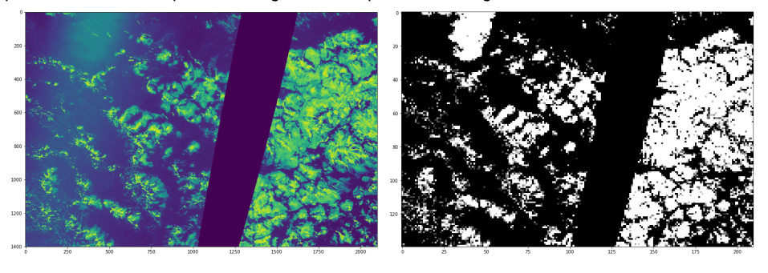
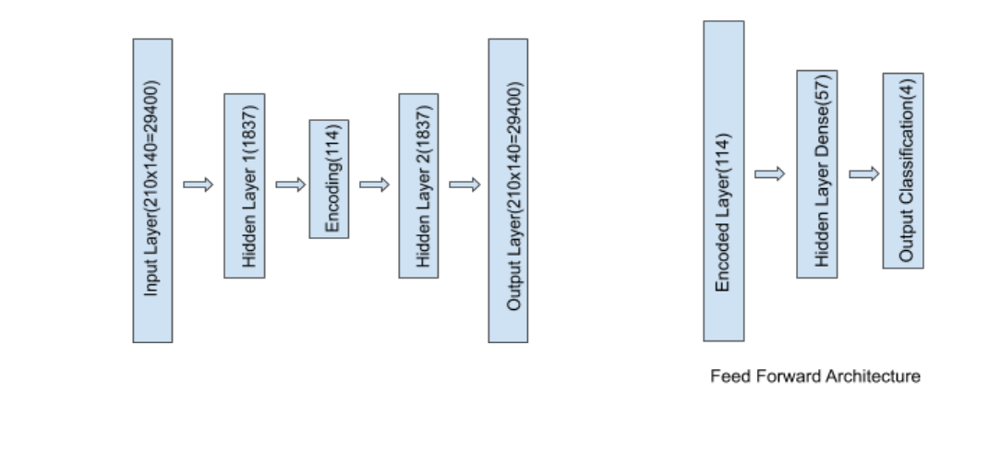

# Multilabel-Image-Classification-using-Contractive-Autoencoder

#### Dataset link : https://www.kaggle.com/c/understanding_cloud_organization
#### About the dataset

The dataset is a collection of satellite images that contain certain cloud formations - Fish, Flower,
Gravel, Sugar. Each image has at least one cloud formations, and some could contain all of them.
The size of the entire dataset is 5546, which has been split into 4500 for training, and the remaining
for testing.

#### Preprocessing

In order to make sure that our model is trainable and moderately accurate, the images were resized
from 2100x1400 to 210x140. After this, the images were converted to black and white images using
the OTSU binarization technique.

The pixel values were normalized for faster computation. Since the classification of the images were
not very obvious, instead of finding the bounding box of the classes, we found whether a particular
class(of the four classes) are present in the image or not. This made it a multilabel classification
problem. Here is a depiction of Original vs. Preprocessed Image

</img>

#### Architecture Used For Contractive Autoencoder:
</img>

All the layers except the output layer had a ReLU activation unit. Since the contractive autoencoder
predicts if a given pixel value is a 0 or 1(for all the 29400 pixels), sigmoid activation function was used
in the final layer. The error metric was binary cross-entropy. The main reason for using binary
cross-entropy was because the gradient of the BCE error is directly proportional to the update made
at that point.

● For training the contractive auto-encoder, Adam optimizer was used so that the effects of both
momentum and RMSProp is considered. 
● Lambda’s value for the Frobenius norm of the Jacobian Matrix in the error term was
10^-5(experimental). 
● The model was trained for 100 epochs and each epoch took about 5 minutes to run. The
model took around 6 hours to train 

A fully connected feedforward neural network was used. The input to this was the encoding of the
contractive autoencoder. The activation units were ReLU(except the final output layer) and Sigmoid
for the output Multi-Label classification. Adam Optimizer was used to train the model. Batch
normalization and Dropout layer was added. This model had 4 nodes in the output layer indicating the
four classes(Fish, Flower, Gravel, Sugar). An 80-20 split was done.

#### Metrics for Evaluating the model:

For a multilabel classification, just measuring the accuracy is not sufficient. The metrics that were
used were:

<h5>Accuracy</h5> 
Accuracy is the most intuitive performance measure and it is simply a ratio of correctly
predicted observation to the total observations.It refers to the closeness of the measurements to a
specific value. A simple comparison between the actual and the predicted value gives us the accuracy
of the model.

<h5>Precision</h5> 
Precision is the ratio of correctly predicted positive observations of the total predicted
positive observations.

<h5>Precision = TP/(TP+FP)</h5>
<h5>Recall</h5>
 Recall is the ratio of correctly predicted positive observations to the all observations in actual
class - yes.

<h5>Recall = TP/TP+FN</h5>
<h5>F1-score</h5>
F1 Score is the Harmonic mean of Precision and Recall. Therefore, this score takes both
false positives and false negatives into account. Intuitively it is not as easy to understand as accuracy,
but F1 is usually more useful than accuracy, especially if you have an uneven class distribution.
Accuracy works best if false positives and false negatives have a similar cost. If the cost of false
positives and false negatives are very different, it’s better to look at both Precision and Recall.

<h5>F1 Score = 2*(Recall * Precision) / (Recall + Precision)</h5>

#### Results

Two models were designed for this dataset. One was with a contractive autoencoder with a
feed-forward neural network that took around 8 hours of computation power on the environment
specified. The other model was a Convolutional Neural Network(CNN) with a feed-forward neural
network. Both the models’ performances are very close and further training can improve results.
<h2>The results for the contractive autoencoder with a feed-forward neural network are as follows:<h2>
<h3> Training Accuracy</h3>

<b>Loss:</b>0.634

<b>Accuracy:</b>0.639

<b>F-1 Score:</b>0.677

<b>Recall:</b>0.646

<b>Precision:</b>0.717

<h3> Testing Accuracy</h3>

<b>Loss:</b>0.688

<b>Accuracy:</b>0.5614

<b>F-1 Score:</b>0.608

<b>Recall:</b>0.589

<b>Precision:</b>0.631

<h2>The results for the Convolutional Neural Network with the feed-forward network for multilabel
classification are as follows:</h2>
<h3> Training Accuracy</h3>

<b>Loss:</b>0.384

<b>Accuracy:</b>0.829

<b>F-1 Score:</b>0.841

<b>Recall:</b>0.0.835

<b>Precision:</b>0.848

<h3> Testing Accuracy</h3>

<b>Loss:</b>0.672

<b>Accuracy:</b>0.658

<b>F-1 Score:</b>0.678

<b>Recall:</b>0.6811

<b>Precision:</b>0.678

